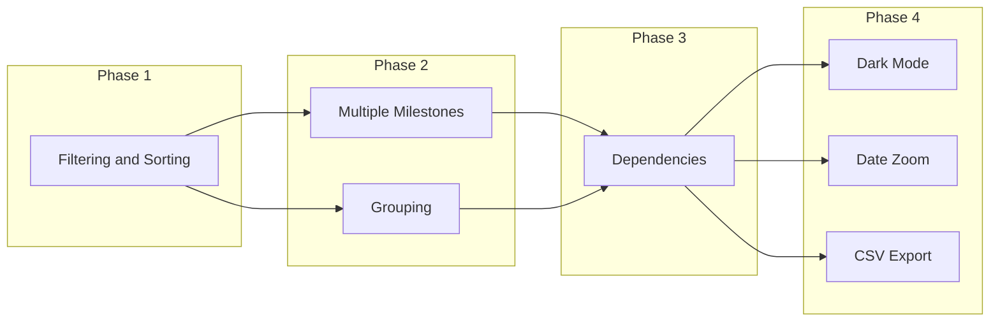

# RoadmapSnap Enhancement Plan

## Priority 1: Filtering and Sorting Deliverables

### Feature

Add interactive controls to filter deliverables by status, risk, or custom tags, and sort by name, status, or milestone dates.

### Implementation

**Config changes** ([js/config_base.js](js/config_base.js)):

```javascript
// Add optional tags to deliverables
{
    name: "Deliverable 1",
    tags: ["backend", "critical"],  // new optional field
    ...
}
```

**UI changes** ([roadmap_dashboard.html](roadmap_dashboard.html)):

- Add filter bar above timeline with:
  - Status dropdown (All / NS / DEV / M0 / M1 / M2 / M3)
  - Risk toggle (All / At Risk Only)
  - Tag filter (multi-select if tags defined)
  - Search box (filter by name)
- Add sort dropdown: Name (A-Z, Z-A), Status, M3 Date (earliest/latest)
- Store filter state in memory, re-render on change

**Functions to add**:

- `filterDeliverables(sources, filters)` - returns filtered array
- `sortDeliverables(sources, sortKey, sortOrder)` - returns sorted array
- `renderFilterControls()` - generates filter bar HTML

---

## Priority 2: Multiple Milestone Tracks

### Feature

Support configurable number of milestones (not just M0-M3). Users define their own milestone keys and labels.

### Implementation

**Config changes** ([js/config_base.js](js/config_base.js)):

```javascript
// Replace fixed MILESTONE_TEXT with dynamic array
MILESTONES: [
    { key: "M0", short: "M0", title: "Dev Complete", subtitle: "...", color: "#8993a4" },
    { key: "M1", short: "M1", title: "QA Validated", subtitle: "...", color: "#ffab00" },
    { key: "M2", short: "M2", title: "UAT OK", subtitle: "...", color: "#36b37e" },
    { key: "M3", short: "M3", title: "Production", subtitle: "...", color: "#0065ff" },
    { key: "M4", short: "M4", title: "Decommission", subtitle: "...", color: "#6554c0" }  // example extra
],

// Deliverable milestones become dynamic
DELIVERABLES: [{
    name: "...",
    milestones: {
        M0: "15/11/2025",
        M1: "20/11/2025",
        // M2, M3, M4... as needed
    }
}]
```

**Code changes**:

- `getCurrentStatus()` - iterate over `CONFIG.MILESTONES` array instead of hardcoded M0-M3
- `calculateStats()` - dynamically count per milestone key
- KPI cards - generate from `CONFIG.MILESTONES` array
- Progress bar segments - generate dynamically
- Legend - generate from milestone array
- CSS colors - use inline styles from config or CSS variables

**Backwards compatibility**: If `MILESTONES` array not present, fall back to current M0-M3 structure.

---

## Priority 3: Dependencies Between Deliverables

### Feature

Define predecessor/successor relationships. Show dependency lines on timeline and warn if dependent item starts before predecessor completes.

### Implementation

**Config changes** ([js/config_base.js](js/config_base.js)):

```javascript
DELIVERABLES: [{
    id: "del-1",  // new: unique identifier
    name: "Deliverable 1",
    dependsOn: [],  // new: array of deliverable IDs
    milestones: { ... }
},
{
    id: "del-2",
    name: "Deliverable 2",
    dependsOn: ["del-1"],  // depends on del-1 completing
    milestones: { ... }
}]
```

**Visual representation**:

- Draw SVG arrows/lines from predecessor M3 to dependent START/M0
- Show warning icon if dependency violated (dependent starts before predecessor M3)
- Optional: highlight dependency chain on hover

**Functions to add**:

- `buildDependencyGraph(sources)` - creates adjacency list
- `validateDependencies(sources)` - returns violations
- `renderDependencyLines(sources, months)` - generates SVG overlay

**Complexity note**: Dependency lines crossing rows require careful positioning. Consider:

- Curved bezier lines between rows
- Or simplified: just show warning icons without visual lines

---

## Priority 4: Grouping with Expand/Collapse

### Feature

Group deliverables into categories (e.g., by team, workstream, phase). Groups can be collapsed to hide their items.

### Implementation

**Config changes** ([js/config_base.js](js/config_base.js)):

```javascript
// Option A: Group property on deliverable
DELIVERABLES: [{
    name: "...",
    group: "Backend Team",  // new field
    ...
}]

// Option B: Separate groups structure
GROUPS: [
    { id: "backend", name: "Backend Team", collapsed: false },
    { id: "frontend", name: "Frontend Team", collapsed: true }
],
DELIVERABLES: [{
    name: "...",
    groupId: "backend",
    ...
}]
```

**UI changes**:

- Group header row with expand/collapse chevron
- Indented deliverables under group
- Click group header to toggle visibility
- Group summary stats (X items, Y at risk)
- "Expand All / Collapse All" buttons

**State management**:

- Store collapsed state in memory (or localStorage for persistence)
- Re-render timeline when toggled

**Functions to add**:

- `groupDeliverables(sources)` - returns `{ groupName: [sources] }`
- `renderGroupHeader(groupName, stats, collapsed)` - generates group row HTML
- `toggleGroup(groupId)` - updates state and re-renders

---

## Priority 5: Additional Enhancements

### 5a. Dark Mode

- Add toggle button in export controls area
- Define CSS variables for dark theme
- Store preference in localStorage

### 5b. Milestone Progress Bars per Row

- Show mini progress indicator in each deliverable row
- Visual: filled segments for passed milestones

### 5c. Date Range Zoom

- Quick buttons: "3 months", "6 months", "12 months", "All"
- Adjusts START_MONTH/END_MONTH dynamically

### 5d. CSV/JSON Export

- Export deliverable data as CSV or JSON
- Useful for reporting/integration

### 5e. Print-Optimized View

- Dedicated print stylesheet
- Hide interactive controls
- Optimize for A4/Letter

### 5f. Keyboard Shortcuts

- `f` - focus filter
- `e` - export menu
- `1-6` - filter by status
- `Esc` - clear filters

---

## Implementation Order




---

## Files to Modify


| File                                             | Changes                                                              |
| ------------------------------------------------ | -------------------------------------------------------------------- |
| [roadmap_dashboard.html](roadmap_dashboard.html) | All UI/rendering changes, new functions, CSS additions               |
| [js/config_base.js](js/config_base.js)           | New config properties (tags, id, dependsOn, group, MILESTONES array) |
| [README.md](README.md)                           | Document new configuration options                                   |


---

## Backwards Compatibility Strategy

All new config properties are optional:

- `tags` - if missing, tag filter hidden
- `id` / `dependsOn` - if missing, dependencies disabled
- `group` / `groupId` - if missing, no grouping
- `MILESTONES` array - if missing, use legacy M0-M3

