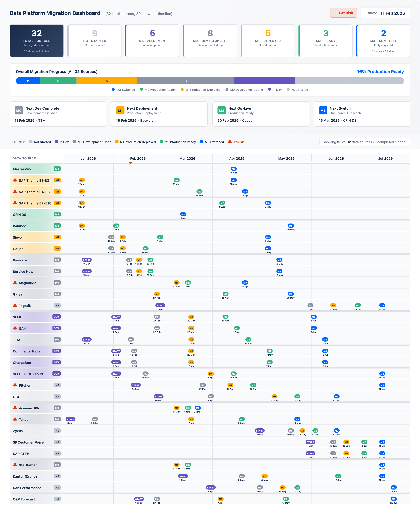

# Data Platform Migration Roadmap

A visual, interactive roadmap dashboard for tracking data platform migration projects. Built as a single HTML file with no server requirements - just open in any modern browser.



## 🎯 Purpose

This tool helps project managers and technical leads visualize and communicate the progress of data migration initiatives. It provides:

- **Executive Summary Dashboard** - High-level KPIs and progress metrics
- **Interactive Timeline** - Visual representation of all data sources and their milestones
- **Risk Visibility** - Clear indicators for at-risk items
- **Export Capabilities** - Generate PNG images for presentations and reports

## ✨ Features

- 📊 **Real-time Status Calculation** - Status automatically computed based on dates
- 🚨 **Risk Indicators** - Visual warnings for at-risk data sources
- 📅 **Flexible Timeline** - Configurable date range
- 🎨 **Color-coded Milestones** - Easy visual identification of progress stages
- 📤 **PNG Export** - Export full roadmap, summary, or timeline separately
- 🔒 **Privacy-friendly** - Runs entirely in browser, no data sent anywhere
- 📱 **Responsive Design** - Works on various screen sizes

## 🚀 Quick Start

1. Download the `index.html` file
2. Open it in any modern web browser (Chrome, Firefox, Edge, Safari)
3. Edit the `CONFIG` section in the file to add your data
4. Refresh the browser to see your changes

No installation, no dependencies, no server required!

## ⚙️ Configuration

All configuration is done in the `CONFIG` object at the top of the JavaScript section in the HTML file.

### Timeline Configuration

```javascript
TIMELINE: {
    TODAY: "11/02/2026",        // Current date (DD/MM/YYYY format)
    START_MONTH: "12/2025",     // Timeline start (MM/YYYY format)
    END_MONTH: "05/2026",       // Timeline end (MM/YYYY format)
}

STATUS_LABELS: {
    NS: "Not Started",
    DEV: "In Development",
    M0: "Dev Complete",
    M1: "Prod Deployed",
    M2: "Production Ready",
    M3: "Switch Complete"
}