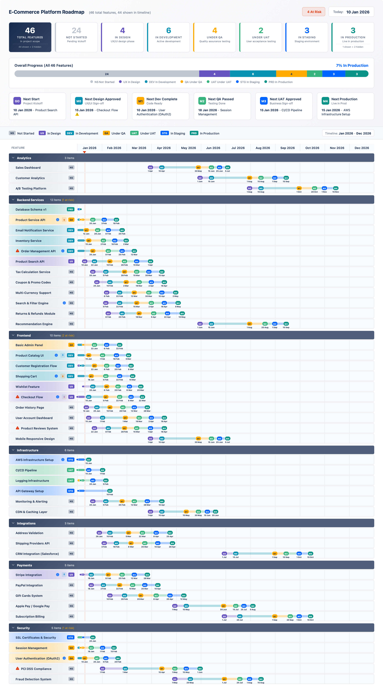

# 🚀 RoadmapSnap

A powerful, client-side roadmap dashboard for project and program management.

**No backend. No database. No build step.**  
Edit `js/config.js` → refresh → done.

Try it with a [sample project](https://roadmapsnap.pages.dev)



-----

## 📖 Description

RoadmapSnap is a single-page roadmap visualization tool that runs entirely in your browser. Built for teams who need powerful tracking without infrastructure complexity.

**Key capabilities:**

- Executive KPI dashboard with automatic status tracking
- Workflow-driven state management
- Interactive dependency visualization
- Risk tracking and filtering
- Timeline zoom (3/6/12 months)
- Export to PNG, CSV, JSON
- Dark mode

-----

## 🎯 Use Cases

- **Executive Reporting** - Auto-calculated KPIs and progress metrics
- **Dependency Management** - Visual graph showing blocking relationships
- **Sprint/Release Tracking** - Track multiple workstreams with timeline zoom
- **Stakeholder Communication** - Export presentation-ready roadmap snapshots

-----

## ✨ Features

- Dynamic KPI cards (click to filter by status)
- Gantt timeline with milestone markers
- Recursive dependency graphs with arrows
- Group/ungroup deliverables
- Search, filter, and sort
- Risk indicators
- Descope support
- Multi-format export (PNG/CSV/JSON)

-----

## 🔧 Installation

**Clone repo:**

```bash
git clone https://github.com/moises-prat-epm/RoadmapSnap.git
cd RoadmapSnap
```

**Open in browser:**

```bash
open index.html    # macOS
start index.html   # Windows
xdg-open index.html # Linux
```

**Or serve locally:**

```bash
python -m http.server 8000
```

-----

## ⚙️ Customization

The `js/` directory contains two config files:

- **`config.js`** — fully populated sample project (e-commerce platform) to explore and learn from
- **`config_base.js`** — minimal blank template to start your own project plan

To build your own roadmap, edit `config_base.js` and save it as `config.js` 

### Quick Reference

**Timeline dates:**

```javascript
TIMELINE: {
    TODAY: "16/02/2026",        // DD/MM/YYYY or "" for auto
    START_MONTH: "01/2026",     // MM/YYYY
    END_MONTH: "12/2026"        // MM/YYYY
}
```

**Custom labels:**

```javascript
ENTITY_LABELS: {
    singular: "Feature",        // e.g., "Project", "Epic"
    plural: "Features",
    scopeLabel: "features"      // lowercase for text
}

DASHBOARD_TEXT: {
    title: "Q2 Product Roadmap",
    totalSubtitleSuffix: "in scope"
}
```

**Workflow (states & milestones):**

```javascript
WORKFLOW: [
    { type: 'state', key: 'NS', short: 'NS', title: 'Not Started' },
    { type: 'milestone', key: 'START', short: 'GO', title: 'Start', color: '#6554c0' },
    { type: 'state', key: 'DEV', short: 'DEV', title: 'In Development' },
    { type: 'milestone', key: 'M1', short: 'M1', title: 'Complete', color: '#00b894' },
    { type: 'state', key: 'DONE', short: 'DONE', title: 'Done' }
]
```

States and milestones alternate. Status is auto-calculated based on which milestone dates have passed.

**Non-filterable groups** (e.g., infrastructure):

```javascript
NON_FILTERABLE_GROUPS: ["Infrastructure", "Planning"]
```

**Group order** (optional). Control the order in which groups appear in the timeline. List group names in your preferred order; groups not listed appear after, sorted alphabetically. Leave empty for alphabetical order:

```javascript
GROUP_ORDER: ["FrontEnd", "Backend", "Database", "Infrastructure"]
// GROUP_ORDER: []   // default: all groups alphabetical
```

**Deliverables:**

```javascript
DELIVERABLES: [
    {
        name: "User Authentication",           // required, must be unique
        group: "Backend",                      // optional
        atRisk: false,                         // optional, shows risk icon
        descoped: false,                       // optional, strikes through
        showInTimeline: true,                  // optional, default true
        tags: ["security", "P0"],              // optional, for search
        link: "https://jira.com/PROJ-123",     // optional, adds info icon
        dependencies: [                        // optional
            "Database Setup",                  // simple: last milestone → START
            { task: "API Gateway", from: "M2", to: "M1" }  // advanced: specific milestones
        ],
        milestones: {                          // required
            START: "01/03/2026",
            M1: "30/03/2026"
        }
    }
]
```

### Config Parameters

|Parameter       |Type   |Required|Description                                 |
|----------------|-------|--------|--------------------------------------------|
|`name`          |string |✅       |Unique deliverable name                     |
|`group`         |string |⬜       |Group name for organization                 |
|`atRisk`        |boolean|⬜       |Show risk indicator (default: false)        |
|`descoped`      |boolean|⬜       |Strike through and grey out (default: false)|
|`showInTimeline`|boolean|⬜       |Show in timeline (default: true)            |
|`tags`          |array  |⬜       |Search tags                                 |
|`link`          |string |⬜       |External link URL                           |
|`dependencies`  |array  |⬜       |Simple strings or `{task, from, to}` objects|
|`milestones`    |object |✅       |`{KEY: "DD/MM/YYYY"}` dates                 |

-----

## 🌐 Publication

Deploy to any static host. No build process needed.

### Quick Deploy Options

**GitHub Pages (Free):**

1. Push to GitHub
1. Settings → Pages → Select branch
1. Live at `https://username.github.io/RoadmapSnap/`

**Netlify (Free):**

1. Drag & drop folder to netlify.com
1. Instantly live with auto-generated URL

**Cloudflare Pages (Free):**

- Connect repo, deploy as static site
- Global CDN included

**Internal Network:**

- Copy files to shared drive
- Open `index.html` from network location

### For Sensitive Data

- Use private GitHub repo (paid) + Pages
- Enable password protection (Netlify/Vercel)
- Deploy to internal intranet
- Create separate `config.public.js` for external version

-----

## 📄 License

**MIT License** - Use freely for personal or commercial projects.

You can use, modify, and distribute this software without restriction. See full license text for details.

-----

**Questions?** Open an issue on [GitHub](https://github.com/moises-prat-epm/RoadmapSnap)
Author Page: [Moises Prat](https://moisesprat.github.io)
